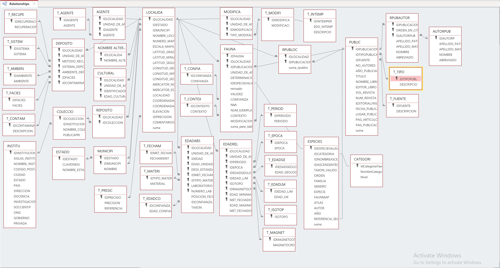

# Examine database mapping

Here is the [link to the google sheet](https://docs.google.com/spreadsheets/d/12oiu0nipG5GV8-elAHH05SZ-NvanV8LGwyOMbNHpM1E/edit?usp=sharing) with the Neotoma - PaVeLA table and column name mapping. 

The PaVeLA database is organized into 42 tables: 
  
  
Here are a list of all the tables in PaVeLA (in ALL CAPS). I've also added some preliminary notes on mapping tables/sets of tables to Neotoma

### Sites and collection units
**LOCALIDA** -- sites  
NOMBRE ALTERNATIVO LOCALIDAD  
AGENTE  
T_AGENTE  
  
MUNICIPI  
ESTADO  
T_PRESC  
  
**DEPOSITO** -- collection unit  
T_RECUPE  
T_SISTEM  
T_AMBIEN  
T_FACIES  
T_CONTAM  
  
REPOSITO --> easy to write a script to test whether these are in Neotoma or upload manually  
COLECCIO --> easy to write a script to test whether these are in Neotoma or upload manually  
INSTITU --> easy to write a script to test whether these are in Neotoma or upload manually  
  
### Age related tables 
Currently linked to LOCALIDA (sites). We'll need to change this to link to samples/fauna?   
  
**CULTURAL**  
  
**EDADABS**  
T_FECHAM  
T_MATERI  
T_EDADCO  
  
**EDADREL**  
T_PERIOD  
T_EPOCA  
T_EDADGE  
T_EDADLM  
T_ISOTOP  
T_MAGNET  
  
MODIFICA  
T_MODIFI  
T_INTEMP  
  
### Analysis units and samples
  
*From what I can tell, there is no analog of analysis units - maybe just one per site?*  
  
**FAUNA** - samples  
T_CONFIA  
T_CONTEX  
  
### Taxa
ESPECIES --> imported manually, just need IDESPECIEVALIDA  
CATEGORI --> imported manually  
  
### Publications
RPUBLOC --> imported manually, just need IDPUBLICACION  
PUBLIC --> imported manually  
RPUBAUTOR --> imported manually  
AUTORPUB --> imported manually  
T_TIPO --> imported manually  
T_FUENTE --> imported manually  
  
  
# Upload PaVeLA to Neotoma

First, we will need to call the relevant packages, including neotoma2 and bulkUploader
```{r setup, include=FALSE}
knitr::opts_chunk$set(echo = TRUE)
require(neotoma2)
require(bulkUploader)
```

First we'll need to work on the site and collection unit info.  In PaVeLA, the relevant table is 'LOCALIDAD'
